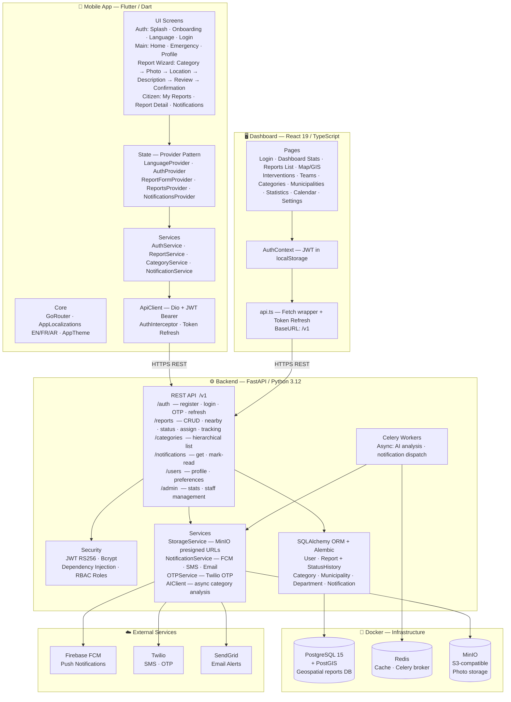

# Sahali — System Architecture

## Quick Reference

| Layer | Tech | Purpose |
|---|---|---|
| Mobile | Flutter 3.11 · GoRouter · Provider | Citizen-facing reporting app (portrait, tri-lingual) |
| Dashboard | React 19 · TypeScript · Tailwind · Recharts | Admin/supervisor web portal |
| Backend | FastAPI · SQLAlchemy · Celery | REST API + async workers |
| Database | PostgreSQL 15 + PostGIS | Geospatial report storage |
| Cache/Queue | Redis | Celery broker + API caching |
| Storage | MinIO (S3) | Report photos |
| Auth | JWT RS256 · Bcrypt | RS256 key-pair in `private.pem` / `public.pem` |
| Push | Firebase FCM | Mobile push notifications |
| SMS | Twilio | OTP verification + SMS alerts |
| Email | SendGrid | Status update emails |
